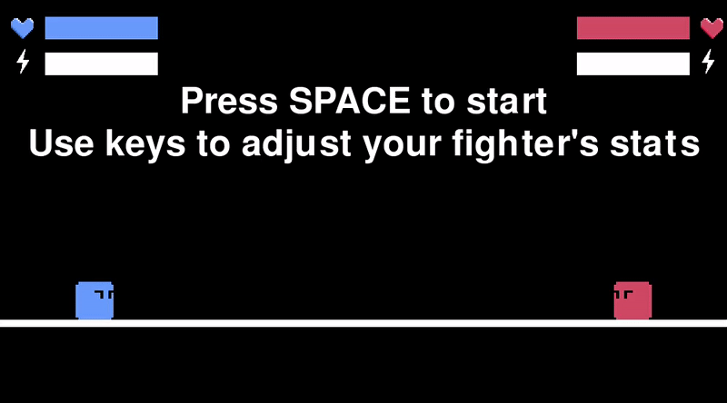

# untitled_fighting_game

1v1 fighting game I'm developing using PyGame in Python. Currently includes basic movement, dashing, sword striking, downward air striking, shielding, knockback, i-frames, stamina, health, and stats customization. Can be played PvP or against a simple heuristic-based AI.

