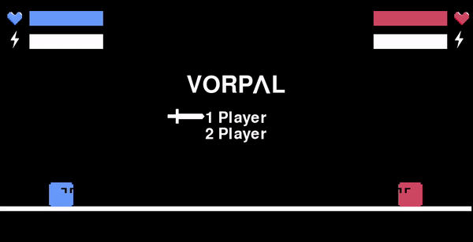
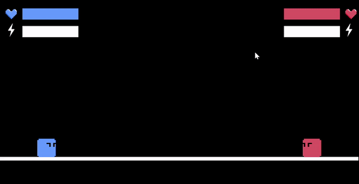
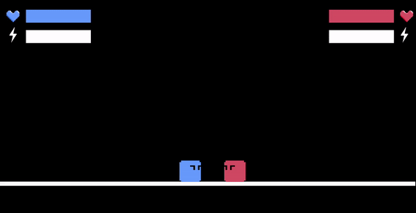
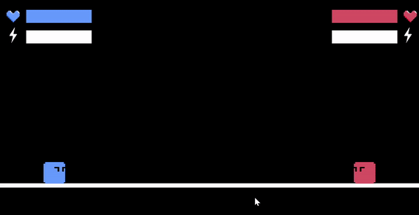
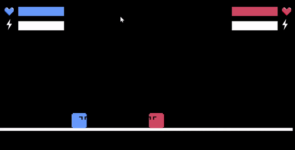

# untitled_fighting_game

1v1 fighting game I'm developing using PyGame in Python. Currently includes basic movement, dashing, sword striking, downward air striking, shielding, knockback, i-frames, stamina, and health. Can be played PvP or against a heuristic-based AI.

## Fighting against the heuristic-based AI

## Gameplay elements
### Sword

### Shield

### Dash

### Downward Air Strike

